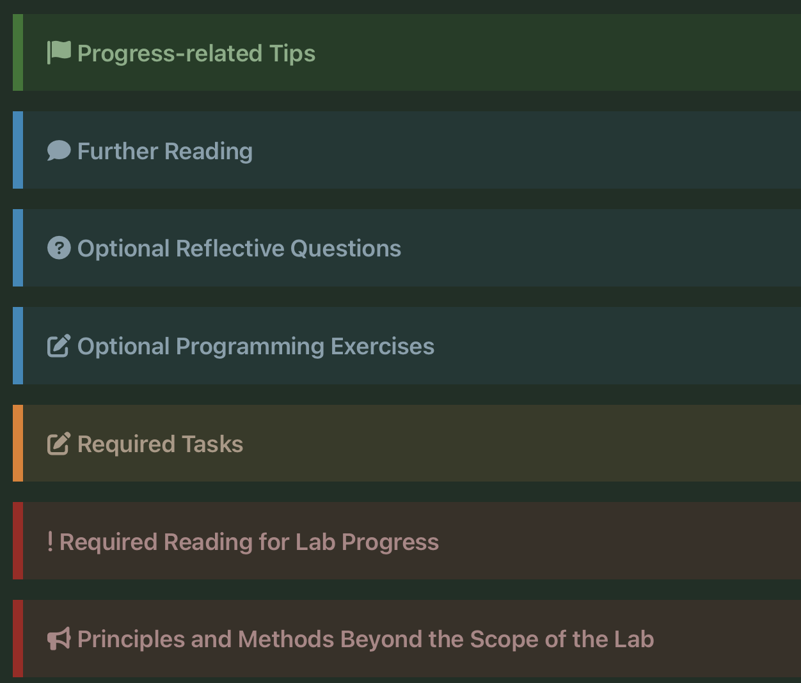

# Chip Design Learning Log

Public log of my self-study in chip design. 

## Structure

```
.
├── README.md              <- this index
├── TEMPLATE.md            <- copying this for every new day
├── log/
│   ├── 2026-07-26-day001.md
│   └── 2026-07-27-day00N.md
├── circuits/              <- .circ files, one per F-section
├── programs/              <- instruction sequences, .hex, disassembly[dont know for now, what this folder will serve for lol]
├── assets/                <- circuit screenshots, waveforms, schematics
└── notes/
    ├── glossary.md        <- terms I keep re-looking-up
    ├── cheatsheets.md     <- Logisim components, RISC-V encodings
    └── questions.md       <- RTFM answers to the handouts' reflective questions, [: i dont know if this gonna be filled, feels overwhelming]
```

## Index

| Day | Date | Stage | Topic | Output |
|-----|------|-------|-------|--------|
| 001 | 2026-07-26 | F1, F2 | How to Ask Smart Questions & Installing and Using Logisim | ✅ |
| 002 | 2026-07-27 | F3 | The basics of digital and logic circuits -> OR gate exercise | ✅ |
| 003 | 2026-07-28 | F3 | Three-input NAND gate ▶ XNOR gate | ✅ |
| 004 | 2026-07-29 | F3 | XNOR gate -> refreshed theory about the transistors and the potentials around them (analyzing custom XOR gate) | 🫠 |
| 005 | 2026-07-30 | F3 | Tried building customized XNOR gate with CMOS | 😭 |
| 006 | 2026-07-31 | F3 | Moving on for now -> tried 3-8 decoder | ♿️ |
| 007 | 2026-08-01 | F3 | had quite of a break + watched a youtube video titled "The Most Ambigious Concept in Computer Architecture" | 🤕 |
| 008 | 2026-08-02 | F3 | Lock in? + built the 3-8 decoder, suiii | ⏩️ | 
| will edit some time | - | - | - | - |

## Roadmap

Roadmap - "One Student, One Chip" (ysyx), F Stage

Handouts: https://ysyx.oscc.cc/docs/en/2407/f/1.html

### [F1 - How to Ask Smart Questions](https://ysyx.oscc.cc/docs/en/2407/f/1.html)
- [x] Read "How To Ask Questions The Smart Way" (ESR)
- [x] Work out what STFW, RTFM, RTFSC stand for and when each applies
- [x] Start the course learning log and keep it current
- [x] Adopt the rule: try to solve it alone first, ask only after the attempt is documented

### [F2 - Installing and Using Logisim](https://ysyx.oscc.cc/docs/en/2407/f/2.html)
- [x] Install Logisim and get a blank circuit simulating
- [x] Component library: Wiring, Gates, Plexers, Arithmetic, Memory, Input/Output
- [x] Wiring, bit width config, Splitter, Probe, Constant, Clock, button-as-clock (_additional stuff_)
- [x] UI familiarization
- [x] XOR gate simple circuit out of inverter and AND gates
- [x] Simple D Flip-flop changing state observation, with auto-propagation disabled

### [F3 - Basics of Digital and Logic Circuits](https://ysyx.oscc.cc/docs/en/2407/f/3.html)
Transistors and gates
- [x] nMOS/pMOS as voltage-controlled switches, CMOS complementary pairs
- [x] NOT, NAND, AND, 3-input NAND, XOR, XNOR from transistors and from gates
- [x] Transistor-count comparison: fully custom vs standard-cell (semi-custom)
- [x] Truth table -> logical expression (skip Karnaugh maps, the course says they don't scale)

Number representation
- [x] Binary and hex encoding, short division, 4-bit grouping
- [x] Sign-and-magnitude, one's complement, two's complement
- [x] Why two's complement lets one RCA do both addition and subtraction
- [ ] Overflow detection from sign bits and carry

Combinational blocks (build each in Logisim, gates only)
- [x] 2-4 decoder, extend to 3-8; seven-segment decoder (decimal, then hex)
- [x] 16-4 encoder; 4-2 priority encoder, extend to 16-4; leading/trailing zero counting
- [x] 1-bit 2-to-1 mux, 3-bit 4-to-1 mux
- [x] 4-bit comparator
- [x] Half adder, full adder, 4-bit ripple-carry adder, 4-bit subtractor
- [x] Sign-magnitude adder, complement adder

Sequential blocks
- [ ] Cross-coupled inverters, metastability
- [x] SR latch (NOR and NAND versions), D latch, D latch with reset
- [x] Why level-triggered latches break synchronous design
- [x] Master-slave D flip-flop, falling-edge version, enable pin, reset
- [ ] 4-bit register, 4-bit counter, sequence-sum circuit for 1+2+...+10, electronic clock

### [F4 - State Machine Model of Computer Systems](https://ysyx.oscc.cc/docs/en/2407/f/4.html)
- [x] Instruction format: opcode vs operand fields; GPR, PC
- [x] sISA: `add`, `li`, `bner0` encodings; hand-assemble to machine code
- [x] Stored-program model: fetch -> execute -> update PC
- [x] Trace `1+2+...+10` by hand as `(PC, r0, r1, r2, r3)` state transitions
- [x] State machine formalism: state set, event set, transition rules, initial state
- [x] The same model applied to: ISA, C programs, digital circuits (Johnson counter)
- [x] C basics: `main`, variables, statements, `printf`, `do-while`; run in Compiler Explorer
- [x] Compilation = mapping the C state machine onto the ISA state machine
- [x] CPU design = mapping the ISA state machine onto a circuit state machine

### [F5 - Simple Processor Supporting Sequence Summation (sCPU)](https://ysyx.oscc.cc/docs/en/2407/f/5.html)
- [x] Instruction cycle: fetch, decode, execute, update PC
- [x] ROM structure: address decoder, word lines, bit lines; ROM as a mux with constant inputs
- [x] Build the fetch path: PC register + ROM holding the summation program
- [x] RAM structure: read path, write path, `EN`, single-port vs multi-port
- [x] Build GPR as RAM; add two read ports plus one write port (`raddr1/2`, `rdata1/2`, `waddr`, `wdata`, `wen`, `clk`)
- [x] sCPU supporting only `li`
- [x] Add `add`: instruction decoder from opcode, mux on `wdata`
- [x] Add `bner0`: comparator, mux on PC input, `wen` deasserted
- [x] Run the full program - expect PC = 7 and 55 in a GPR
- [x] Write the sum-of-odds program and run it
- [x] Add a custom `out rs` instruction driving a seven-segment display
- [ ] Separate data path from control logic; fill in the control-signal table

### [F6 - Simple Input/Output](https://ysyx.oscc.cc/docs/en/2607/f/6.html)
- [ ] New finalized sISA: `add` (`00`), `io` (`01`), `li` (`10`), `bner0` (`11`)
- [ ] `io` semantics: `i/o=0` input (`R[rd] <= dev[idx]`), `i/o=1` output (`dev[idx] <= R[rd]`)
- [x] `li` rework: `s` selects which 2-bit segment of the 8-bit output `imm` is shifted into - implement as a 4-to-1 mux
- [x] `bner0` rework: `offset` is PC-relative (range -8 to +7), sign-extend it, add to PC
- [x] Rewrite the sequence-summation program using the enhanced instructions
- [x] Instantiate `LED Bar` (Input Format = One Wire, Segments = 8)
- [ ] Instantiate two `Hex Digit Display` (Has Decimal Point = No)
- [ ] Split 8-bit value into two 4-bit halves, one per display
- [ ] Instantiate `Dip switch` (Number of Switch = 8)
- [ ] Instantiate 8 `Button` components
- [ ] Implement full step-by-step summation (LED = current term, seven-segment = running sum, advance one loop per LSB-button press) - target ~12 instructions, mind the `bner0` offset range (-8 to +7) when placing the loop

### [E5 - A Fully Functional Mini RISC-V Processor (minirv)](https://ysyx.oscc.cc/docs/en/2607/e/5.html)
- [x] RTFM the RISC-V spec: PC width, GPR count/width, role of `x0`, instruction formats, RV32I vs RV32E
- [ ] minirv spec: RV32E register count, 8 instructions - `add`, `addi`, `lui`, `lw`, `lbu`, `sw`, `sb`, `jalr`
- [ ] Decode by comparator on `inst[6:0]` and `inst[14:12]` rather than a full decoder
- [ ] Immediate handling: zero-extend vs sign-extend, Bit Extender component
- [ ] Byte-addressed ISA memory on top of word-wide circuit memory (address shifting)
- [ ] Two-instruction minirv (`addi` + `jalr`); run the provided `_start`/`fun`/`halt` test
- [ ] Add `add` and `lui`
- [ ] Configure the RAM component (32-bit data, byte enables, async read, separate buses)
- [ ] Add `lw` and `sw`; assume aligned access only
- [ ] Add `lbu` and `sb`; byte select on read, byte write enables on write
- [ ] Run `mem.hex` and `sum.hex` (6000 cycles each); check PC near `halt` and `a0` = 0
- [ ] Add a 64-bit cycle counter to know when a program has finished
- [ ] Add `RGB Video` (256x256, 888 RGB) and an address decoder producing `isVGA`/`isMem`
- [ ] Memory-mapped I/O at `[0x20000000, 0x20040000)`; map address -> (X, Y)
- [ ] Run `vga.hex` (628,000 cycles, 1-2 hours) and get the OSOC logo on screen
- [ ] Write up why Logisim doesn't scale: design effort, simulation speed, debuggability

<!--  -->


Let's get to the grind)
