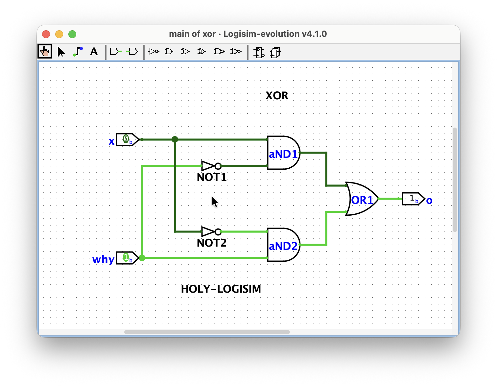
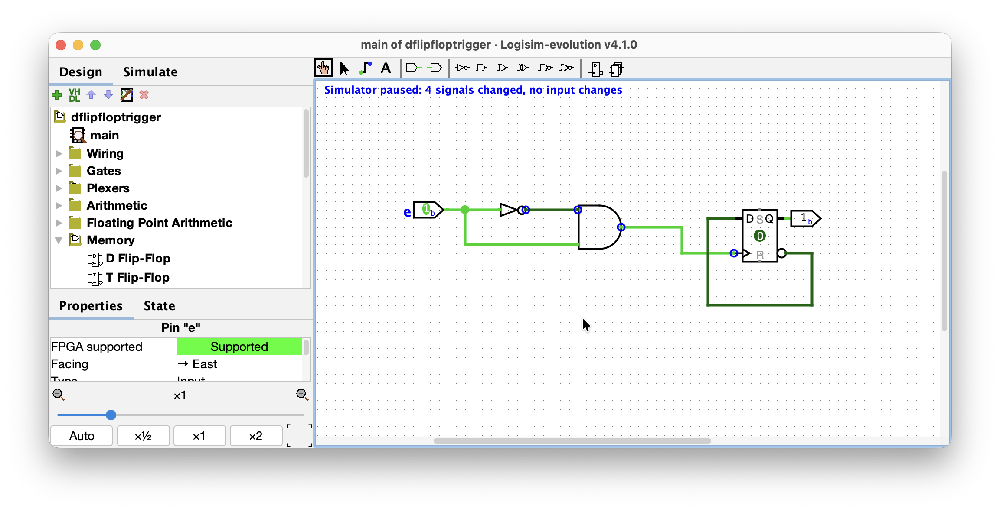

# Day 001 - 2026-07-26

**Stage:** F1, F2 <!-- F1 | F2 | F3 | F4 | F5 | F6 -->
**Topic:** Logisim, Digital Circuits<!-- e.g. priority encoder / two's complement overflow / sCPU decode -->
**Time:** 3h <!-- 1h 30m -->

---

## Goal
<!-- One sentence. What did I want to be able to do by the end of today? -->
i shall be able to easily construct simple digital circuits and observe the theoretical simulations.

## Notes
Learned the three principles of learning for real: STFW, RTFM, and RTFSC – of which i thought that they're some concepts in computer architecture, lol. Gotta be more independent :)

Done, with the F1, telling me when to ask the questions. If the three principles failed to achieve the spark (STFW, RTFM, RTFSC), only then the questions arise 

Also, on the helping others, i shall not be a google search, which pops-up the answer right away, instead redirect which sources and where the the answer could be derived from. Or just say RTFM, in short, if they're stubborn enough :0

built the first digital circuit — XOR gate out of inverter and AND gates, though it was present in the built-in libraries. 

built a simple d flip-flop input device shown in the example for sequential propagations, by disabling the instant propagation mode.

skimmed through the whole interface of the logisim. Gotta need some time to explore the core functionlities later on.

explored dip switch. It's basically a multi-input switch device clustered into one bulk. 

wanted to build something with the 7-segments and dip-switch devices. Like, lighting up 1, 2, 3 with each of their own buttons. Came out to be hard.


### Diagram / waveform
<!-- Paste an image, ASCII schematic, or link to assets/day000-*.png -->
got my first digital circuit (though it's "hello-world" tutorial in a sense) — XOR.circ:


to observe the propogation of the simulation of some of the circuits such as the d flip-flop:

```
```

## Open questions
<!-- Things I could not explain to someone else yet. Carry these forward. -->
- [ ] will arise when building the circuit for 7-seg Digit Lighter.
