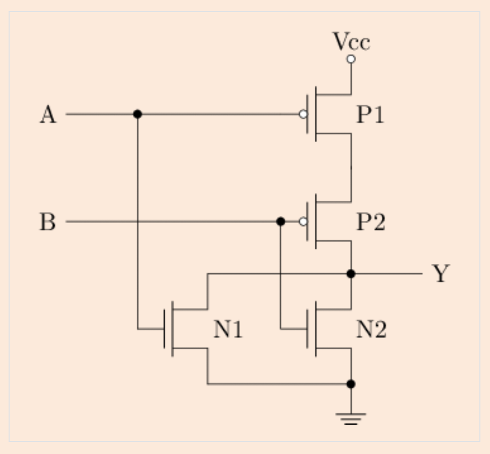
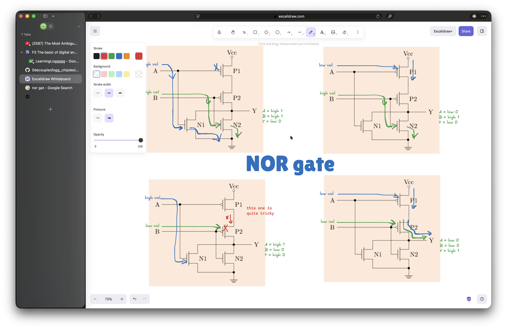
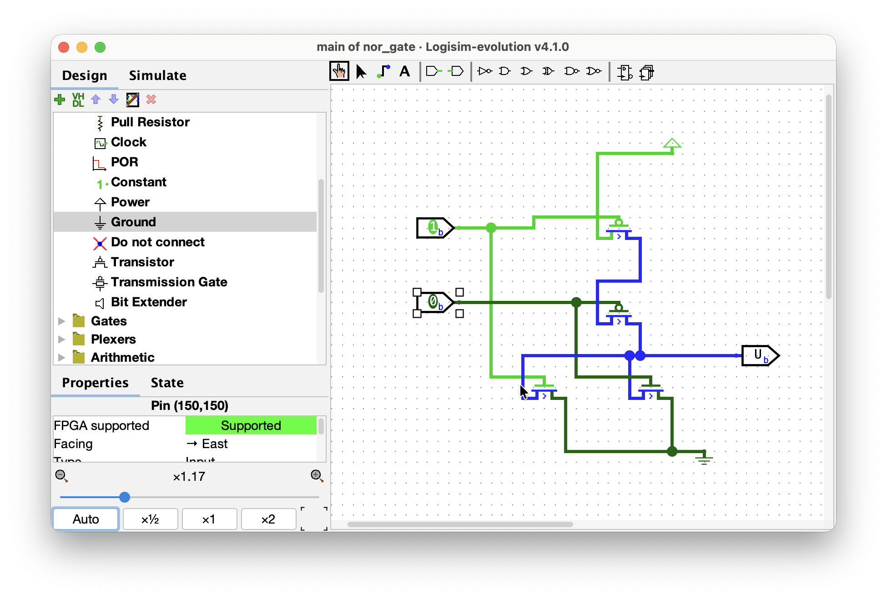
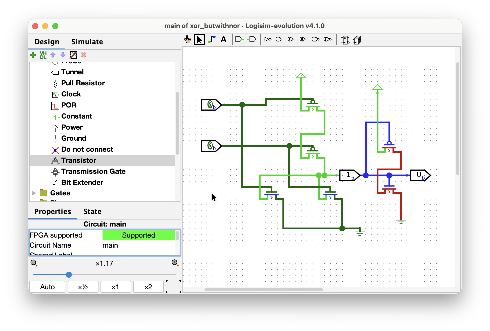

# Day 002 — 2026-07-27

**Stage:** F3 <!-- F1 | F2 | F3 | F4 | F5 | F6 -->
**Topic:** logic gates, encoding, combinational logic, latches <!-- e.g. priority encoder / two's complement overflow / sCPU decode -->
**Time:** 3h (5h 30m if we count the audio lesson) <!-- 1h 30m -->

---

## Goal
<!-- One sentence. What did I want to be able to do by the end of today? -->
be able to mindfully construct main device circuits using logic gates such as NAND, XNOR, 7-seg display decoder (/encoder), bit operations, latches, flip-flops, and, finally, a digital clock.

## Notes

okay, first off, i needed to help my family with some outdoor work, so i had to somehow engage with the topics, though not that efficiently. so, i opted for NotebookLM to generate an audio or podcast version of the whole F3 stage, which was 48 minutes long. I managed to get some sense out of the concepts where it didn't require me to interact with the visual illustrations or numbers. so, i did listen to the audio 3 times. 3 times.

now, at 9 p.m. i am here at my laptop, preparing for the real grind. The previous engagement with the content shall be refreshing for this session.

leaving this caption cuz i found it to be good: 
> _since P1 and P2 are connected in parallel, when one of them is conductive, Y is 1_
=> meaning, whichever receives low voltage or 0, Y gonna be 1.
> _since N1 and N2 are connected in series, when both are conductive, Y is 0._
=> so, they both gotta be 1s, as they love it, for them to go to grounnd, or no path to the Y = 0.

analyzed the circuit given as the first task, which turned out to be a NOR gate! Got quite stuck when the A = 1 and B = 0, where it turns out the A, being high, doesn't let the voltage source to flow from pMOS1, so the conduction from B, being low, for pMOS2 isn't complete without the power supply, that is blocked by pMOS1.

when working with building OR gate with CMOS transistors, i did know that using NOR gate with an inverter is the way and is standard, but i still wanted to build it with switching the pMOS and nMOS transistors or building off from scratch. I also remembered the thing from the audio that nMOS's potential is dropped when connected to power supply and the input pin, while pMOS get diminutive voltage just from the nMOS, which will flow a floating voltage state. It is by design rules of CMOS considered as undefined state leading to errors. Before actually trying this off, i did build the inverted NOR gate just because it was easy to build, but wanted to challenge myself with a pull request that was closed decades ago, lol. spent an hour for that 😭

as i got quite arrogant with the non-existing OR gate without an inverted NOR gate, it's almost 12 a.m. So, will be continuing on this F3, more hubmly tomorrow. 

### Concepts
<!-- Definitions, rules, formulas. Write them in my own words, not copied. -->
- -nMOS takes in high state voltages, while +pMOS allows only low state voltage from the pins. 
- -nMOS seems to struggle when connected in parallel and to a power supply, which, if given high state from the gate, spits out a floating state voltage that can't be considered a high state, or i.e. undefined state. +pMOS is the same when is supplied with insufficient voltage goes struggling.
- in chemistry level, a MOSFET is like a bridge on a river with two points that connect and go on only if the source is hot enough for the river to release vapor (or negative electrons gather to the conductive gate because of electric field) that metaphorically builds a walkable path between source and drain :) 

### Diagram / waveform
<!-- Paste an image, ASCII schematic, or link to assets/day000-*.png -->

Needed to analyze this circuit and find out which gate it is:

which turned out to be a NOR gate!:

i got stuck on the A = 1 and B = 0, where i went to Logisim for help:

OR gate with inverted NOR gate:

> P.S the circuit files are in the %../circuits/% directory ;)

## Bugs and fixes

| Symptom | Cause | Fix |
|---------|-------|-----|
| was busy with construction chores | simultaneously wanted to help the family and be able to grasp F3 😭 | fed NotebookLM with F3 page, to generate the audio-podcast to somehow study along the way |
| couldn't build OR gate with no inverted NOR gate | cuz it's almost impossible, it just doesn't align with electrical rules of the transistors | went off with just inverting the NOR gate :]

## Open questions
<!-- Things I could not explain to someone else yet. Carry these forward. -->
- [x] none (=_=)
