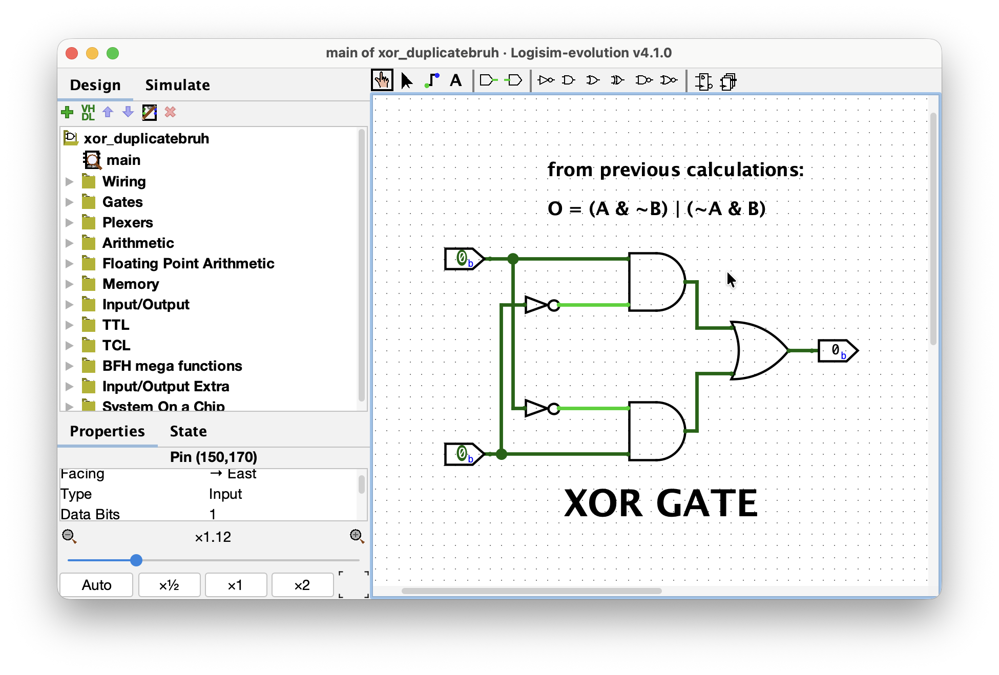
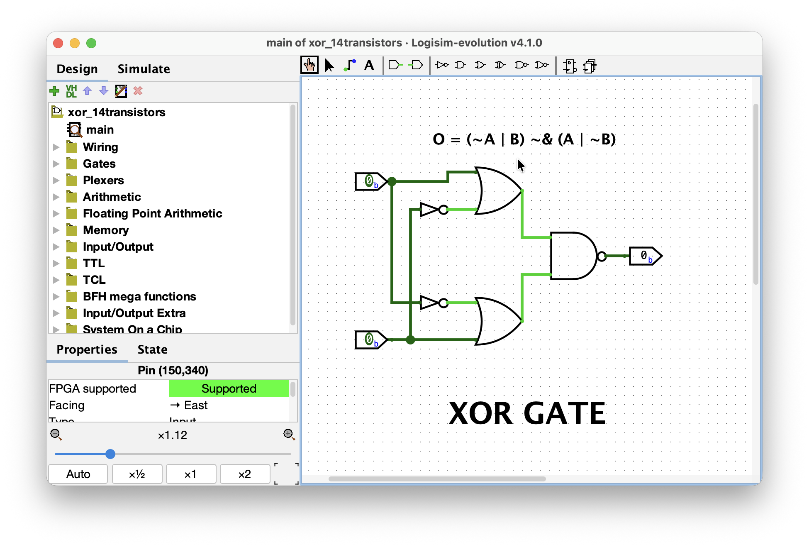
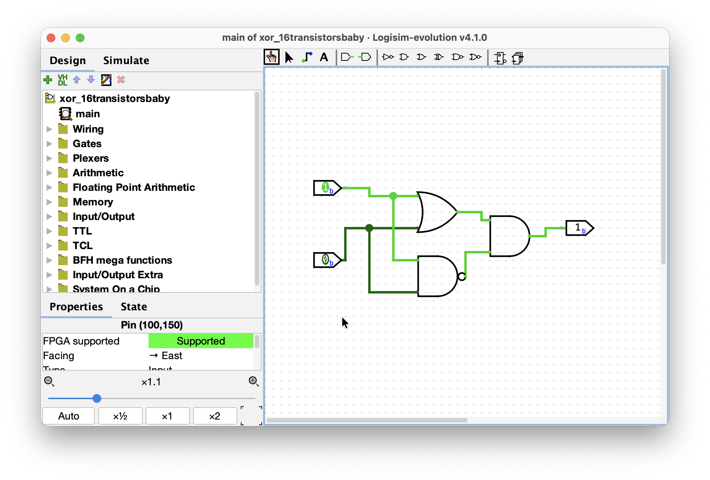
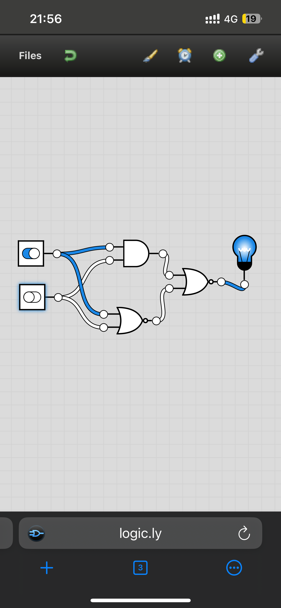
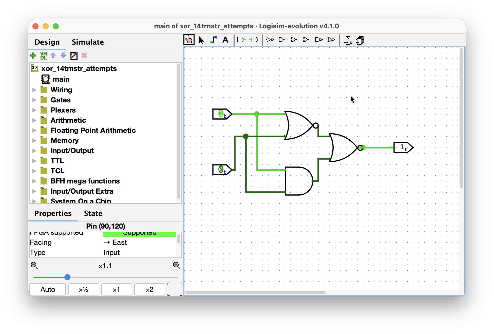

# Day 003 - 2026-07-28

**Stage:** F3 <!-- F1 | F2 | F3 | F4 | F5 | F6 -->
**Topic:** 3-input NAND, XOR circuitry<!-- e.g. priority encoder / two's complement overflow / sCPU decode -->
**Time:** 3h <!-- 1h 30m -->

---

## Goal
<!-- One sentence. What did I want to be able to do by the end of today? -->
get the most of the F3 done consuming and the exercises to build. 

## Notes

so, we were left off at Three-input NAND gate. 
> Comparison of the number of transistors required for the two implementations of 3-input NAND gate

as i remember from the previous session, AND gate is basically just an inverted NAND gate, so it takes 6 transistor for it to build (4 for NAND, 2 for NOT). Next, NAND is built out of 4 transistors, totalling in 10 transistors for the first circuit with just gates.

using pure transistor circuits, it sums up to just 6 transistors. It is more efficient computationally, as it just builds upon the parallel and series connection idea in the transistor lanes. 

i did the circuit for XOR gate, which i realized after building i did this one in the tutorial for Logisim. Anyway, the circuit works and the transistor count is 2 inverters + 2 AND gates + OR gate, so 2 * 2 + 2 * 6 + 6 = 22 transistors. Bazar Jackson.

i did multiple attempts to the 14 transistor goal for XOR gate. First one was 20 transistors – very simple one. Second was quite motivating for me as it got me 16 transistors, very close to the optimal solution. For a quite of time i was scratched my head around.

after some extracurricular stuff i did outdoors, coming back home by a bus, i hoped to some random circuit building website to recreate the XOR gate with 14 transistors, which i really did! Later at home, transfered to Logisim.

gotta go sleep.


### Concepts
<!-- Definitions, rules, formulas. Write them in my own words, not copied. -->
- when we need to find the logical expression due to the given truth table, we can opt to the rows where the output signal is 1, say for XOR operation. And use those rows to write the individual logical expressions:
    ```
    A = 1, B = 0 => A & ~B
    A = 0, B = 1 => ~A & B
    ```
    and we perform an OR operation to get the working logical expression: ``` (A & ~B) | (~A & B) ```

-

### Diagram / waveform
<!-- Paste an image, ASCII schematic, or link to assets/day000-*.png -->
i realized i did the circuit for XOR gate during tutorial for Logisim, though did it without that realization:


XOR gates with minimum transistor count attempts:
1. 20 transistors


2. 16 transistors


3. finally 14 transistors (1st one is when i got the working circuit on a phone, 2nd one transfered into Logisim)



