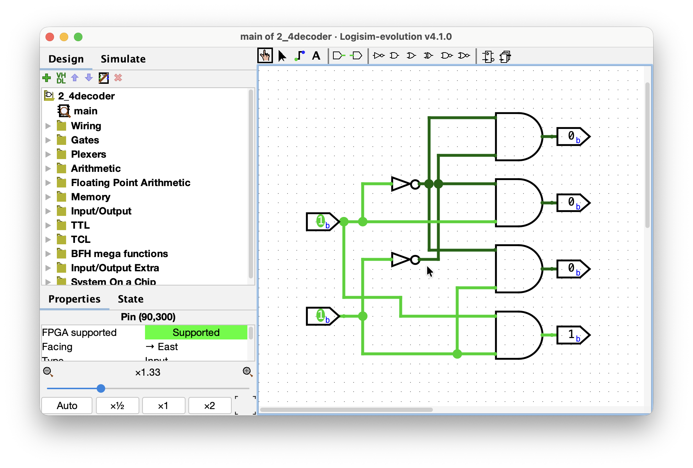
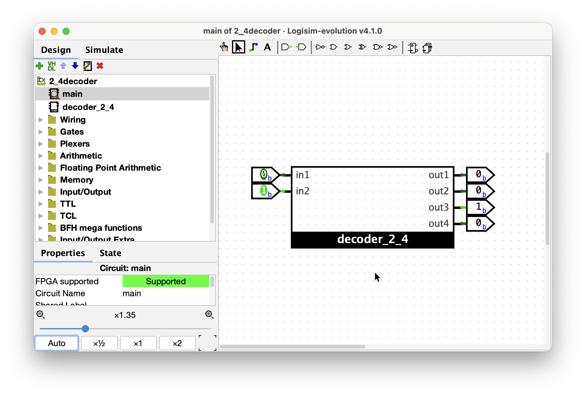

# Day 6-7 (yo is that 67 merged?) 2026-07-31 - 2026-08-2

**Stage:** F3 <!-- F1 | F2 | F3 | F4 | F5 | F6 -->
**Topic:** Decoder <!-- e.g. priority encoder / two's complement overflow / sCPU decode -->
**Time:** 2h <!-- 1h 30m -->

---
## Notes

tried all the session building the 3-8decoder with two 2-4 decoders with my own effort and brain.

### Concepts
<!-- Definitions, rules, formulas. Write them in my own words, not copied. -->
- Decoder -> circuit that lays out `k` bits on input into `2^k` bits of output. Like a one-hot encoding in scikit-learn. Just mapping each bit-case value into a decimal partner.
-

### Diagram / waveform
<!-- Paste an image, ASCII schematic, or link to assets/day000-*.png -->
2-4 Decoder:

using Subcircuits:

## Truth table / expression
<!-- Derive it here before wiring anything. Wiring first is how i lose an evening. -->

A_2|A_1|A_0| |Y_7|Y_6|Y_5|Y_4|Y_3|Y_2|Y_1|Y_0
|--|---|---|-|---|---|---|---|---|---|---|---|
0 | 0 | 0 | | 0 | 0 | 0 | 0 | 0 | 0 | 0 | $1
0 | 0 | $1 | | 0 | 0 | 0 | 0 | 0 | 0 | $1 | 0
0 | $1 | 0 | | 0 | 0 | 0 | 0 | 0 | $1 | 0 | 0
0 | $1 | $1 | | 0 | 0 | 0 | 0 | $1 | 0 | 0 | 0
$1 | 0 | 0 | | 0 | 0 | 0 | $1 | 0 | 0 | 0 | 0
$1 | 0 | $1 | | 0 | 0 | $1 | 0 | 0 | 0 | 0 | 0
$1 | $1 | 0 | | 0 | $1 | 0 | 0 | 0 | 0 | 0 | 0
$1 | $1 | $1 | | $1 | 0 | 0 | 0 | 0 | 0 | 0 | 0
