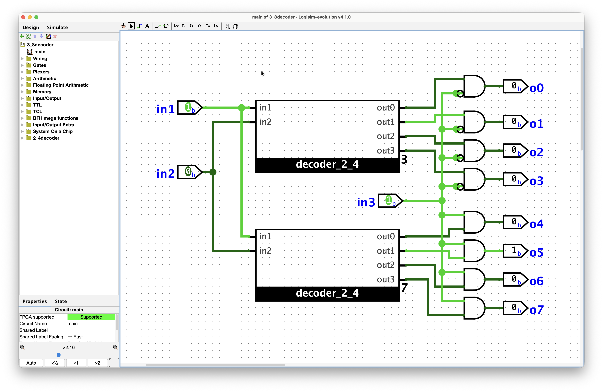

# Day 08 - 02-08

**Stage:** F3 <!-- F1 | F2 | F3 | F4 | F5 | F6 -->
**Topic:** <!-- e.g. priority encoder / two's complement overflow / sCPU decode -->
**Time:** <!-- 1h 30m -->

---

## Notes

done with the 3-8 decoder, without any help from outside sources, just changing the approach. 

### Concepts
<!-- Definitions, rules, formulas. Write them in my own words, not copied. -->
-
-

### Diagram / waveform
<!-- Paste an image, ASCII schematic, or link to assets/day000-*.png -->
3-8 decoder, наконец-тө:



## Truth table / expression
<!-- Derive it here before wiring anything. Wiring first is how i lose an evening. -->

```text
A B | Y
0 0 | 
```

## Transistor / gate count
<!-- The handouts keep asking for this comparison. Record it while i still remember. -->
- My version:
- Best known:

## Bugs and fixes

| Symptom | Cause | Fix |
|---------|-------|-----|
| | | |
