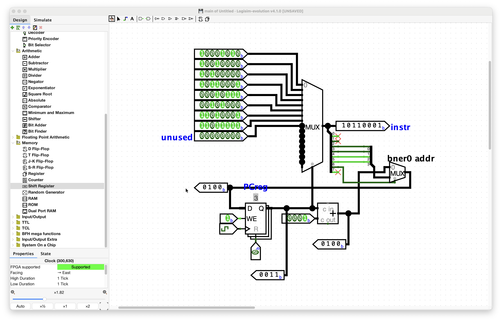
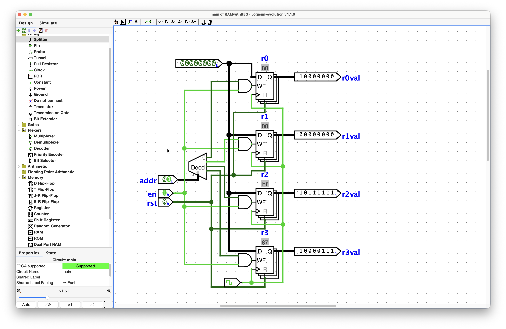
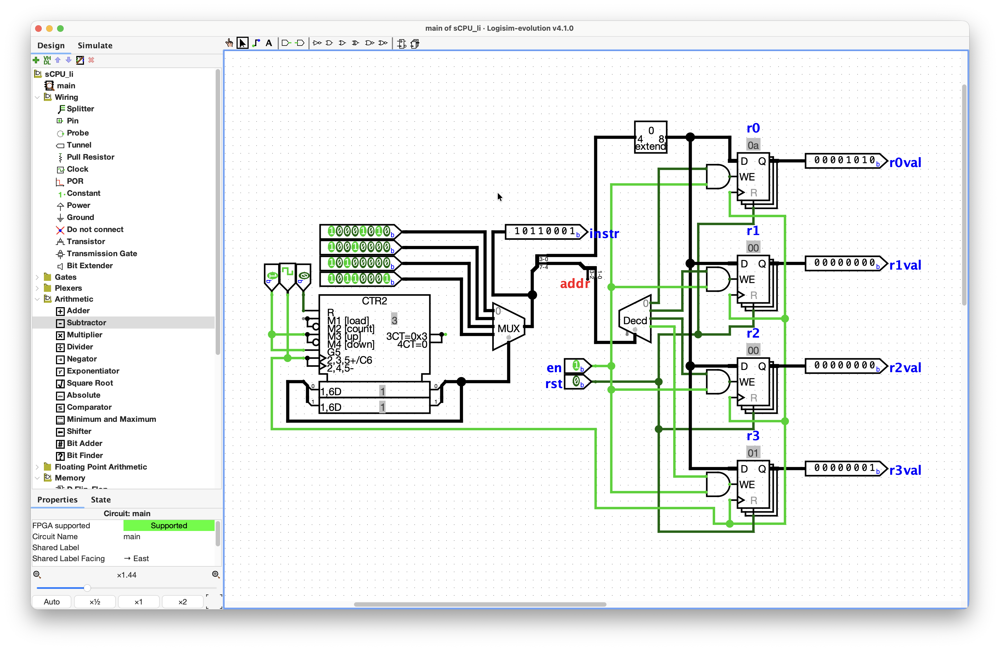
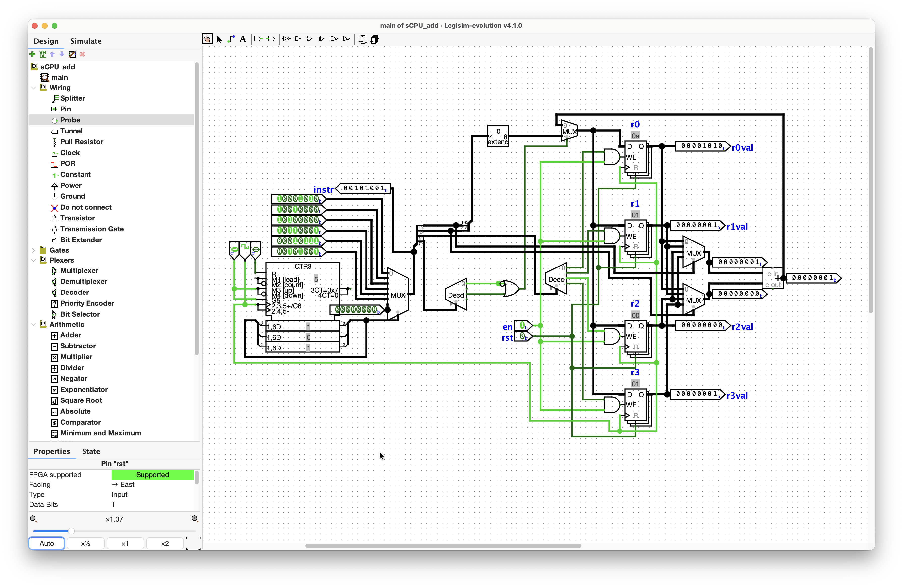

# Day 016 - 2026-08-16

**Stage:** F5 <!-- F1 | F2 | F3 | F4 | F5 | F6 -->
**Topic:** Fetch, Decode, Execute <!-- e.g. priority encoder / two`s complement overflow / sCPU decode -->
**Time:** <!-- 1h 30m -->

---

## Notes

specifics:
> PC bit width is 4 bits, initial value is 0 -> how many different instructions stored in ROM to point to.
There are 4 GPRs, each with a bit width of 8 bits -> (r0, r1, r2, r3)
Supports the following 3 instructions -> `add`, `li`, `bner0` [2bits]

*clarifications from my behalf*:
> is it "how many types of instructions exist" or "how many instruction slots your ROM can have"? -> i think it's the latter. As the instruction itself is 8 bits long like `00010001` which means `add` opcode, store the addition of r0 and r1 into r1 and another one `10100101` which means `li` opcode, store a decimal value of 5 into r2, so it goes on and on until we can make up 16 different instructions whether it's adding or loading a value or `bner0` with each GPRs. It's how many instructions we can make up with the 8 bits. PC register's bit value is decoded as a one-hot value that will choose the embedded instruction in the ROM, those `10100101`, `00010001`, and so on, whichever is needed for the next operation.
the opcode is 2 bits long. so, 4 different operations can be mapped. 
so, i got the GPRs. It's actually (r0, r1, r2, r3) or 4 variables that store data.
`addr` in `bner0` in 4 bits long as in PC bit width, as it points to a specific jumping address, while `rs2` needs 2 bits. The leftover 2 bits from 8 bit-long instruction is for the `bner0` opcode specification. 

`add` instruction for sCPU to-do:
- [x] 2-4 decoder for `add` and `li` opcodes for one-hot code
- [x] 2 read ports and 1 write port for GPR modules
    - [x] 1st read port: `raddr1` (read address), `rdata1` (read data) -> `rs1` register
    - [x] read port: `raddr2`, `rdata2` -> `rs2` register
    - [x] Write port: `waddr` (write address), `wdata` (write data), `wen` (write enable), `clk` (clock) -> `rd` register.
- [x] adder component
- [x] `waddr` as decoding address, `add` result as `li` instruction
- [x] MUX to select the `wdata` from either `li` or `add` instruction, where the select terminal take the one-hot code from the decoding earlier.
- [x] write the `wdata` value into corresponding GPR.

quite did it.

take a look at the circuits section below for the tasks :)
### Concepts
<!-- Definitions, rules, formulas. Write them in my own words, not copied. -->
- I liked this wording on the ROM description as a multiplexer in the abstract sense: 
> *Consequently, reading from ROM can be viewed as selecting one memory word from multiple stored words, where the address addr acts as the multiplexer`s selection input, and all memory words serve as its data inputs. Notably, information stored in ROM is directly encoded using voltage levels (high/low), making the ROM functionally equivalent to a multiplexer with constant data inputs.*

### Diagram / waveform
<!-- Paste an image, ASCII schematic, or link to assets/day000-*.png -->
built the ROM with MUX:

built the RAM writing operation with Registers:

built an sCPU with only `li` instruction:

built an sCPU with both `li` and `add` instruction:

