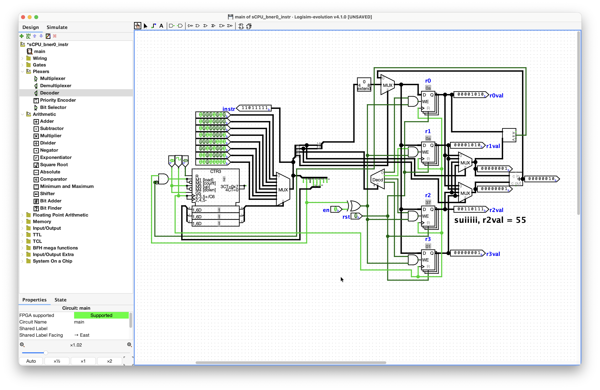
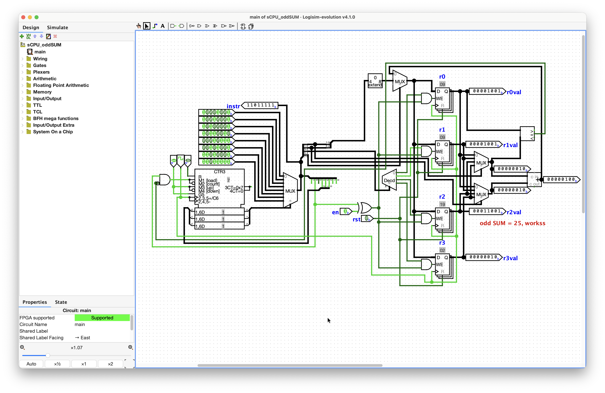
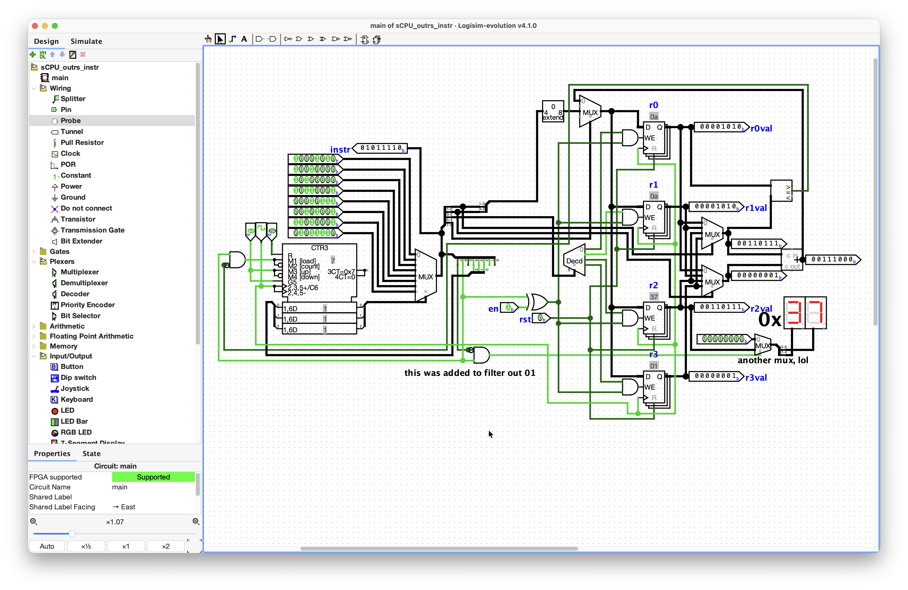

# Day 017 - 2026-08-17

**Stage:** F5 <!-- F1 | F2 | F3 | F4 | F5 | F6 -->
**Topic:** bner0 instruction into sCPU <!-- e.g. priority encoder / two`s complement overflow / sCPU decode -->
**Time:** 3h <!-- 1h 30m -->

---

## Notes

Let me , go through my circuit in process. On the left side, we have the ROM for storing and reading the instructions from (of which we have 8, they're on top of the counter or PC register). To select the instructions we have a huge MUX_rom, whose select terminal comes from either a PC register (counter) or `addr` specified by the `bner0` instructions, so they have their own little MUX_pcreg for this selection. 

```
6: bner0 r1, 4
7: bner0 r3, 7
in binary instructions:
11010001
11011111
```

The select terminal of that MUX_pcreg should come from the opcode specification, or i.e. when it's `11` the select terminal should get high signal, making the way for `addr` from the instruction to the MUX_rom. Also, the enable pins of the counter or PC register counter should be set to low somehow to prevent the increment to the next instruction, so that it won't be 2 instructions ahead after the 4th instruction is executed (4th instr cuz of `addr` from `bner0`). So, it should increment only when the opcode is not `11`, basically. You could see that i tried doing it using an AND gate right next to the enable pin and up-down pin, so that the signal would be passed when both terminals are high (so it should depend on the second terminal as it's responsible to tell if the instruction is `bner0`).  But can't figure out how, for now.

After the instruction is selected i used a splitter to make my life easier (though it feels like cheating). The 6-7 data bits (or the opcodes) go to the MUX_wdata's select terminal, on the top middle-ish. It selects the `wdata` derived from `add`, `li`, and `bner0` instruction operations. So, they all basically perform calculations , but only one gets the ticket. I think it could be improved to only operate one opcode instruction, not all the operations, for efficiency matters. On the left of MUX_wdata, there is an zero-extender for the `li`'s `imm` value, which is 4 bits, so we need 8 bits to satisfy 8 bit `wdata` conventions. Going a bit to the right, we have the RAM, itself. The `wdata`, coming from the MUX_wdata, goes to all the `D` inputs of all the registers, but only gets written as the write enable pin (`wen`) is high due to the one-hot code gotten from the 2-4 decoder for the 4 GPRs (r0, r1, r2, r3). The decoder itself gets the `k` bits from the split 4-5 data bits of the chosen instruction.

On the far right, we have two MUX_addin for `add` instruction to select, the stated registers from `rs1` and `rs2`. Supposedly, there is an adder and the output goes straight to the MUX_wdata.

There is also a comparator on top of adder for the `bner0` instruction that essentially straightly gets the `r0` value from the Q-latch of the `r0` register and gets the value of `r1` from the one of MUX_addin which gets the select signal from the right-most bits. And, now here i got stuck. Cuz, here are the things i am not being able to do right now:

* how to make MUX_pcreg to select the `addr` from `bner0` instruction
* how to make a kinda "switch" for enable pins to not increment when it's time for `bner0` instruction, but it also should act according to the comparator, so when `r1` = `r0`, the PC register does the increment and passes to the MUX_rom to the last instruction

after, some little misconceptions ruled in my brain and not knowing how the input load *actually* works in a counter (PC register), i got it by abandoning MUX_pcreg and wire the `addr` of `bner0` instruction into the input load (which used to be always taken by the output pin of the counter, itself, lol).

As speculated, i used the AND gate before supplying enable and increment pins of the counter that is dependent on the opcode bit of the instruction. So, yeah it works.

> now, adding `out rs` instruction.

```
 7  6 5  4 3   2 1   0
+----+----+-----+-----+
| 00 | rd | rs1 | rs2 | R[rd]=R[rs1]+R[rs2]      ADD instruction for register addition
+----+----+-----+-----+
| 10 | rd |    imm    | R[rd]=imm               LI instruction (Load Immediate with zero-extension)
+----+----+-----+-----+
| 11 |   addr   | rs2 | if (R[0]!=R[rs2]) PC=addr BNER0 instruction (Branch if Not Equal to Register 0)
+----+----------+-----+
| 01 |   addr   | rs2 | R[rs2] read, PC=addr    Output in hex format to the display and PC updates to addr (i mean why not)
+----+----------+-----+
```
and it worked, perfectly.


take a look at the circuits section below for the tasks :)

### Diagram / waveform
<!-- Paste an image, ASCII schematic, or link to assets/day000-*.png -->
finally, added `bner0` instruction into my sCPU:


odd sequence summation result checks out:


yet another instruction added, `out rs`:

