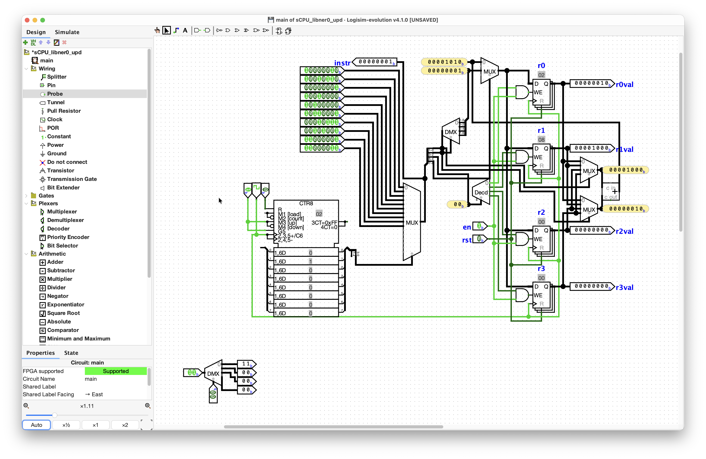
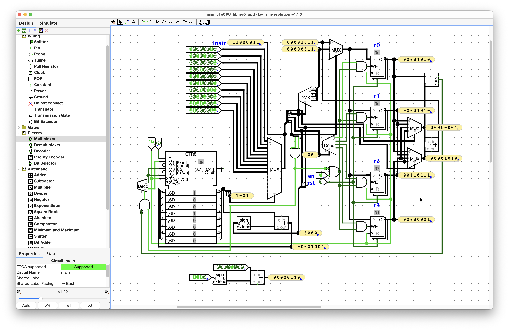
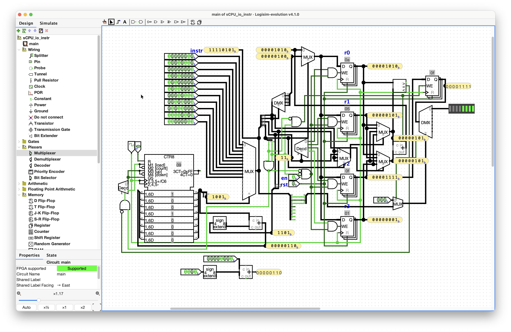
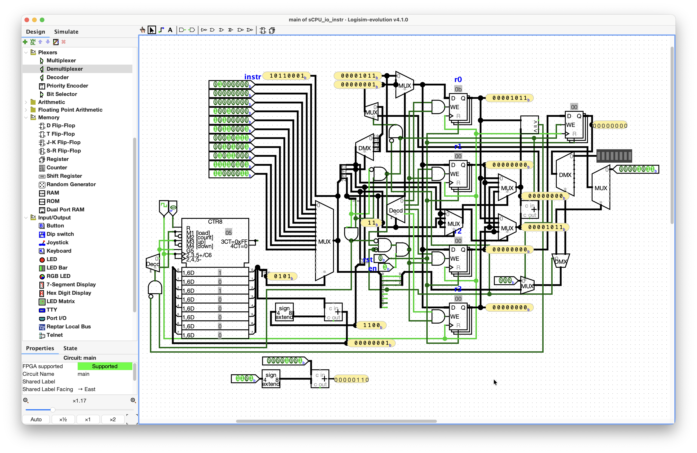

# Day 026 - 18-08 <!-- DD-MM -->

**Stage:** F6 <!-- F1 | F2 | F3 | F4 | F5 | F6 -->
**Topic:** enhanced `li` instruction<!-- e.g. priority encoder / two's complement overflow / sCPU decode -->
**Time:** <!-- 1h 30m -->

---

## Notes

> on building a `li+` instruction (enhanced `li`):

the day before, i was somehow trying to understand how to map the `imm` into the necessary segment, or implement `<<` (shifter) operation. Tried using Bit Shifter for that, but turned out it just shift one bit once, though i need 2 bits to hop at the same time.

today, though, my dopamine is so high right now, cuz it took me an hour to independently figure out that i needed a deMUX with a Splitter to place 2-bit `imm` into a corresponding segment according to `s`. 

I took `r1` as a temporary variable to store the second segment `0b1000`, so to add it to `r0` = `0b0010` and store to `r0`. 

Then, for the remaining GPRs, `r1` will always overwrite itself to its necessary value. I'M SO HAPPY FOR FIGURING OUT THE DEMUX, OMG. I was like thinking of using decoder but it didn't suite cuz it was not a deselector but just the switch for one of 4 ways. I thank my eyes who caught the Demultiplexer circuit on the left sidebar, to check if it's the thing i was looking for. Ok, let's get serious

now, i need to implement the `bner0+` instruction.

wasn't much of a problem. edited the select terminal to use comparator's signal and opcode bits with AND gate. comparator's `rs2` input pin is taking from the MUX_addin on the right.

suii, enhanced sCPU with `imm` capacity raised to 8-bits or d255, now.

> LED for `io` instruction:

for reference:
```c
 7  6  5  4  3   2  1   0
+--+--+--+--+---+--+--+--+
| 01 | rd |i/o|   idx   | R[rd]<=>dev[idx]
```

- [x] `[idx]` -> which device to access: `000` -> LED
- [x] `rd` = `rs2`. have to implement MUX for the select terminal of one of MUX_addin
- [x] build a register for LED output to retain the data from `io` instruction, while other instructions are being executed. 
    - [x] enable pin to the `io` opcode? using AND gate.
- [x] write the instruction sequence after calculation.

ok, so, in order to not mitigate the use of LED and register data to change, i used the `wen` pin to be high whenever the opcode is `io` with AND gate. Also, the control signal for the devices i again used deMUX_device with the select terminal coming from another MUX_selectd, which also gets the control signal from the opcode case. I put the new instruction `01011000` after the second `add` instruction to see the summation right on checking with `bner0`.

> DIP switch `#TO-DO`:

- [ ] `i/o` bit should the selector between LED and DIP switch, as they share the same control signal for the deMUX.
- [x] when `i/o` = 0 (input), `rd` should get the data from the corresponding device (dip switch, button).
- [x] change the hardcoded `r0` value -> read from a DIP switch: use MUX 

bro my whole circuit became a jungle/spaghetti 😭
this debugging of the `wen` of the RAM is getting out of my hand.

for this day, enough i guess, though expected more.

### Diagram / waveform
<!-- Paste an image, ASCII schematic, or link to assets/day000-*.png -->

`li+` instruction:


and added the `bner0+` instruction:


LED bar as output:


unresolved input feature with DIP switch (just put the fries in the bag):


